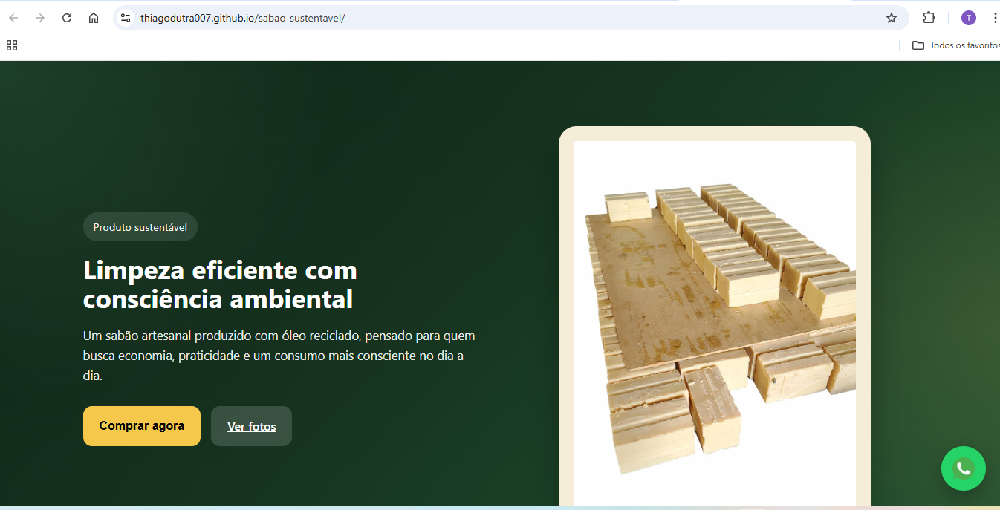

# Sabão Sustentável – Landing Page
## Preview

Projeto de uma **landing page simples e responsiva** para divulgação de um produto sustentável artesanal.

O site apresenta o produto, seus benefícios e permite que o cliente entre em contato diretamente pelo **WhatsApp** para realizar a compra.

🔗 **Acesse o site:**  
https://thiagodutra007.github.io/sabao-sustentavel/

---

## Objetivo

Criar uma página clara, acessível e responsiva para apresentar o produto e facilitar o contato direto com o cliente.

A proposta do projeto é demonstrar como **soluções digitais simples podem apoiar pequenos negócios locais**, além de incentivar o consumo consciente.

---

## Tecnologias Utilizadas

- HTML5
- CSS3 (Mobile First)
- JavaScript
- Git
- GitHub Pages

---

## Funcionalidades

- Layout responsivo (desktop e mobile)
- Botão de compra com redirecionamento para WhatsApp
- Galeria de fotos do produto
- Animações suaves na interface
- Estrutura otimizada para landing page

---

## Aplicação

Este projeto foi utilizado na divulgação de um **produto artesanal de sabão sustentável**, produzido a partir do reaproveitamento de óleo usado.

A iniciativa contribui para:

- Redução do descarte incorreto de resíduos
- Incentivo ao reaproveitamento de materiais
- Consumo mais consciente

---

## Decisões de Desenvolvimento

O projeto foi desenvolvido utilizando **HTML, CSS e JavaScript puro**, com o objetivo de manter o site:

- leve
- rápido
- fácil de manter
- acessível para pequenos negócios

Também foi adotada a abordagem **Mobile First**, garantindo boa experiência em dispositivos móveis.

---

## Deploy

O site está publicado via **GitHub Pages**:

https://thiagodutra007.github.io/sabao-sustentavel/

---

## Autor

Desenvolvido por **Thiago Dutra**
